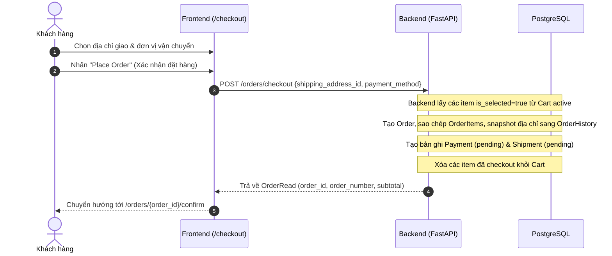
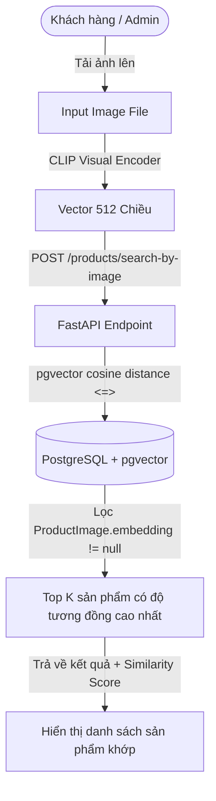

# 🛒 Electron-Gate — System Architecture & User Flow Specification

> **Version:** 2.0 (Verified August 2026)  
> **Tech Stack:** FastAPI (Python 3.11+) · PostgreSQL with `pgvector` · Next.js 16 (App Router + Turbopack) · Tailwind CSS (Atelier Terminal Theme)  
> **Mục tiêu tài liệu:** Cung cấp tài liệu quy chuẩn kỹ thuật toàn diện cho các nhà phát triển frontend, backend và QA để hiểu rõ luồng người dùng (user journeys), bản đồ màn hình, hợp đồng API (API contracts), cấu trúc dữ liệu, và quy tắc nghiệp vụ (business constraints).

---

## 📋 Mục lục

1. [Auth Flow (Xác thực & Quản lý phiên)](#1-auth-flow)
2. [Product Catalog & Browsing Flow (Duyệt & Tìm kiếm sản phẩm)](#2-product-catalog--browsing-flow)
3. [Cart Flow (Quản lý giỏ hàng)](#3-cart-flow)
4. [Checkout & Order Placement Flow (Đặt hàng & Thanh toán)](#4-checkout--order-placement-flow)
5. [Order Tracking & Account Flow (Theo dõi đơn hàng & Lịch sử)](#5-order-tracking--account-flow)
6. [Customer Address Book Flow (Quản lý sổ địa chỉ giao hàng)](#6-customer-address-book-flow)
7. [Admin — User & Role Management (Quản trị tài khoản & Vai trò)](#7-admin--user--role-management)
8. [Admin — Product, Variant, Spec & Category Operations (Quản trị Catalog)](#8-admin--product-variant-spec--category-operations)
9. [Admin/Staff — Order Lifecycle Management (Xử lý vòng đời đơn hàng)](#9-adminstaff--order-lifecycle-management)
10. [Admin/Staff — Payment & Shipment Operations (Thanh toán & Vận đơn)](#10-adminstaff--payment--shipment-operations)
11. [Admin/Staff — Inventory Management (Quản lý tồn kho 5 phân hệ)](#11-adminstaff--inventory-management)
12. [Admin — Geographic Territory Management (Quốc gia & Thành phố)](#12-admin--geographic-territory-management)
13. [Admin — Delivery Provider Management (Đơn vị vận chuyển / 3PL)](#13-admin--delivery-provider-management)
14. [Visual Search & Product Images Architecture (Tìm kiếm ảnh CLIP & pgvector)](#14-visual-search--product-images-architecture)
15. [AI Knowledge Base & RAG Assistant Flow (Trợ lý RAG & Quản lý tài liệu)](#15-ai-knowledge-base--rag-assistant-flow)
16. [System-Wide RBAC Matrix (Ma trận phân quyền hệ thống)](#16-system-wide-rbac-matrix)
17. [Complete Frontend Route & Source File Mapping (Bản đồ source code)](#17-complete-frontend-route--source-file-mapping)

---

## 1. Auth Flow

### 1.1 Đăng ký (Sign Up)
* **Frontend View:** `/signup` (hoặc `/register`)
* **Component:** `frontend/src/app/signup/page.tsx`
* **Backend Router:** `backend/api/routers/auth.py`

| Bước | Hành động | Method & Endpoint | Request Body | Role / Quyền |
|:---:|---|---|---|:---:|
| 1 | Người dùng nhập email + mật khẩu | — | — | Public |
| 2 | Gửi form đăng ký | `POST /auth/register` | `{"email": "user@example.com", "password": "password123"}` | Public |
| 3 | Backend tạo user với role mặc định `User` | — | Trả về thông tin User đã tạo | Backend |
| 4 | Tự động đăng nhập / chuyển hướng | → `/login` | — | — |

---

### 1.2 Đăng nhập (Sign In)
* **Frontend View:** `/login`
* **Component:** `frontend/src/app/login/page.tsx`

| Bước | Hành động | Method & Endpoint | Request Body | Role / Quyền |
|:---:|---|---|---|:---:|
| 1 | Người dùng nhập email + password | — | — | Public |
| 2 | Gửi yêu cầu đăng nhập (JSON) | `POST /auth/login` | `{"email": "user@example.com", "password": "password123"}` | Public |
| *Alt* | Đăng nhập chuẩn OAuth2 Form | `POST /auth/token` | Form-data: `username=...&password=...` | Public |
| 3 | Nhận `access_token` JWT | — | `{"access_token": "eyJ...", "token_type": "bearer"}` | Client |
| 4 | Lưu token vào `localStorage` (`token`) và Cookie | — | Cập nhật AuthContext state | Client |
| 5 | Lấy thông tin user hiện tại | `GET /auth/me` | Header `Authorization: Bearer <token>` | Authenticated |
| 6 | Redirect theo role | — | `User` → `/`, `Staff` / `Admin` → `/admin/inventory` hoặc `/admin/products` | Client |

---

### 1.3 Đăng xuất & Quản trị mật khẩu
* **Đăng xuất:** Xóa `token` khỏi `localStorage` / cookie, reset `AuthContext`, redirect về `/login`.
* **Admin Reset Password:**
  * **Endpoint:** `POST /auth/reset-password`
  * **Role:** `Admin` only
  * **Payload:** `{"email": "target@example.com", "new_password": "newSecurePassword!"}`

---

## 2. Product Catalog & Browsing Flow

### 2.1 Danh sách sản phẩm (Product Grid)
* **Frontend View:** `/products` (và `/`)
* **Component:** `frontend/src/app/products/page.tsx`
* **Backend Routers:** `backend/api/routers/products.py`, `backend/api/routers/categories.py`

| Hành động | Method & Endpoint | Query Params / Body | Ghi chú |
|---|---|---|---|
| Load danh mục lọc | `GET /categories` | — | Hiển thị tabs danh mục sản phẩm |
| Load danh sách sản phẩm | `GET /products` | `?page=1&page_size=20&sort_by=created_at&sort_order=desc` | Phân trang catalog |
| Lọc theo danh mục | `GET /products` | `?category_id={uuid}` | Lọc sản phẩm thuộc danh mục |
| Tìm kiếm từ khóa | `GET /products` | `?search={keyword}` | Tìm kiếm theo tên / mô tả sản phẩm |
| Lọc theo khoảng giá | `GET /products` | `?min_price=100&max_price=500` | Lọc theo giá |

**Cấu trúc dữ liệu sản phẩm hiển thị:**
```json
{
  "product_id": "8d390d01-a1cd-4a43-896e-c55dc7977339",
  "name": "Mechanical Keyboard Pro",
  "description": "Ergonomic aluminum body with hot-swappable switches",
  "image_url": "https://.../keyboard.webp",
  "categories": [{ "category_id": "...", "name": "Keyboards" }],
  "variants": [
    {
      "variant_id": "...",
      "model": "Tactile Brass",
      "color": "Midnight Black",
      "price": 149.00,
      "status": "active"
    }
  ]
}
```

---

### 2.2 Chi tiết sản phẩm (Product Detail)
* **Frontend View:** `/products/{product_id}`
* **Component:** `frontend/src/app/products/[id]/page.tsx`
* **Backend Routers:** `products.py`, `product_variants.py`, `product_specs.py`, `product_images.py`

| Hành động | Method & Endpoint | Quyền hạn | Mô tả |
|---|---|:---:|---|
| Chi tiết sản phẩm | `GET /products/{product_id}` | Public | Tên, mô tả, ảnh cover, danh mục, variants |
| Thư viện ảnh gallery | `GET /products/{product_id}/images` | Public | Danh sách ảnh bổ trợ & ảnh theo variant |
| Thông số kỹ thuật (Specs) | `GET /products/{product_id}/specs` | Public | Danh sách cặp `spec_name: spec_value` |
| Thêm vào giỏ hàng | `POST /carts/{cart_id}/items` | User | Đưa variant được chọn vào giỏ |

---

## 3. Cart Flow

### 3.1 Giỏ hàng người dùng (Active Shopping Cart)
* **Frontend View:** `/cart`
* **Component:** `frontend/src/app/cart/page.tsx`
* **Backend Routers:** `backend/api/routers/carts.py`, `backend/api/routers/cart_items.py`

| Hành động | Method & Endpoint | Payload | Mô tả nghiệp vụ |
|---|---|---|---|
| Lấy giỏ hàng active của tôi | `GET /carts/me` | — | Tự động tạo giỏ hàng mới nếu chưa có |
| Thêm variant vào giỏ | `POST /carts/{cart_id}/items` | `{"variant_id": "...", "quantity": 1, "is_selected": true}` | Nếu variant đã có trong giỏ, tự động cộng dồn số lượng |
| Cập nhật số lượng | `PUT /carts/{cart_id}/items/{variant_id}` | `{"quantity": 3}` | Thay đổi số lượng mua |
| Chọn / Bỏ chọn mua | `PUT /carts/{cart_id}/items/{variant_id}` | `{"is_selected": true/false}` | Chỉ các item `is_selected=true` mới được chuyển qua Checkout |
| Xóa item khỏi giỏ | `DELETE /carts/{cart_id}/items/{variant_id}` | — | Gỡ sản phẩm ra khỏi giỏ |
| Xóa toàn bộ giỏ hàng | `DELETE /carts/{cart_id}` | — | Xóa sạch giỏ hàng active |

---

## 4. Checkout & Order Placement Flow

### 4.1 Quy trình Thanh toán (Checkout)
* **Frontend View:** `/checkout`
* **Component:** `frontend/src/app/checkout/page.tsx`
* **Backend Router:** `backend/api/routers/orders.py`



* **API Endpoints phục vụ Checkout:**
  1. `GET /addresses/me`: Danh sách địa chỉ đã lưu của khách hàng.
  2. `GET /delivery-providers?is_active=true`: Danh sách hãng vận chuyển đang hoạt động.
  3. `POST /orders/checkout`:
     ```json
     // Request Body
     {
       "shipping_address_id": "3fa85f64-5717-4562-b3fc-2c963f66afa6",
       "payment_method": "credit_card" // "credit_card" | "cod" | "bank_transfer"
     }
     ```

---

### 4.2 Xác nhận đơn hàng (Order Confirmation)
* **Frontend View:** `/orders/{order_id}/confirm`
* **Component:** `frontend/src/app/orders/[id]/confirm/page.tsx`
* **Endpoints:**
  * `GET /orders/{order_id}`: Chi tiết mã đơn, ngày tạo, tổng tiền, địa chỉ.
  * `GET /orders/{order_id}/payment`: Trạng thái thanh toán (`pending`, `paid`).

---

## 5. Order Tracking & Account Flow

### 5.1 Danh sách đơn hàng của tôi
* **Frontend View:** `/account/orders`
* **Component:** `frontend/src/app/account/orders/page.tsx`
* **Endpoint:** `GET /orders` (Backend tự động lọc chỉ trả về đơn của `current_user` khi role là `User`).

---

### 5.2 Chi tiết đơn hàng & Vận đơn
* **Frontend View:** `/account/orders/{order_id}`
* **Component:** `frontend/src/app/account/orders/[id]/page.tsx`
* **Endpoints:**
  1. `GET /orders/{order_id}`: Thông tin đơn hàng.
  2. `GET /orders/{order_id}/items`: Danh sách sản phẩm mua, đơn giá, số lượng.
  3. `GET /orders/{order_id}/history`: Lịch sử thay đổi trạng thái (Audit Timeline).
  4. `GET /orders/{order_id}/shipment`: Hãng vận chuyển, mã vận đơn (Tracking number), thời gian giao hàng.
  5. `GET /orders/{order_id}/payment`: Phương thức thanh toán, số tiền, trạng thái (`pending`, `paid`, `refunded`).

**Quy trình trạng thái đơn hàng (Order Status Lifecycle):**
```
pending → confirmed → processing → shipped → delivered → completed
                                           ↘ cancelled
```

---

## 6. Customer Address Book Flow

* **Frontend View:** `/account/addresses`
* **Component:** `frontend/src/app/account/addresses/page.tsx`
* **Backend Router:** `backend/api/routers/addresses.py`

| Hành động | Method & Endpoint | Payload / Params | Ghi chú nghiệp vụ |
|---|---|---|---|
| Xem sổ địa chỉ của tôi | `GET /addresses/me` | — | Trả về danh sách địa chỉ kèm quốc gia & thành phố |
| Thêm địa chỉ mới | `POST /addresses` | `{"address_line1": "...", "city_id": "...", "phone": "...", "is_default": true}` | Nếu `is_default=true`, tự động gỡ default của các địa chỉ cũ |
| Cập nhật địa chỉ | `PUT /addresses/{address_id}` | `{"address_line1": "...", "is_default": true}` | Cập nhật thông tin địa chỉ |
| Xóa địa chỉ | `DELETE /addresses/{address_id}` | — | ⚠️ Bị chặn nếu địa chỉ đã phát sinh đơn hàng |

---

## 7. Admin — User & Role Management

* **Frontend Views:** `/admin/users`, `/admin/roles`
* **Components:** `frontend/src/app/admin/users/page.tsx`, `frontend/src/app/admin/roles/page.tsx`
* **Backend Router:** `backend/api/routers/people.py`, `backend/api/routers/auth.py`

### 7.1 Quản lý người dùng (Users)
| Hành động | Method & Endpoint | Role | Mô tả |
|---|---|:---:|---|
| Danh sách người dùng | `GET /people/users` | Admin | Phân trang, hiển thị email, role, ngày tạo |
| Chi tiết 1 người dùng | `GET /people/users/{user_id}` | Admin | Xem thông tin chi tiết tài khoản |
| Tạo người dùng mới | `POST /people/users` | Admin | Cấp tài khoản với role chỉ định (`User`, `Staff`, `Admin`) |
| Cập nhật thông tin / Role | `PUT /people/users/{user_id}` | Admin | Thay đổi role hoặc email của user |
| Đặt lại mật khẩu (Reset) | `POST /auth/reset-password` | Admin | Cấp lại mật khẩu mới cho user qua email |
| Xóa người dùng | `DELETE /people/users/{user_id}` | Admin | Xóa tài khoản vĩnh viễn |

### 7.2 Quản lý vai trò (Roles)
* `GET /people/roles`: Lấy danh sách các vai trò hệ thống (`User`, `Staff`, `Admin`).
* `POST /people/roles`: Tạo vai trò tùy biến mới.

---

## 8. Admin — Product, Variant, Spec & Category Operations

* **Frontend Views:** `/admin/products`, `/admin/products/{id}`, `/admin/categories`
* **Components:**
  * `frontend/src/app/admin/products/page.tsx` (Bảng sản phẩm, lọc, tạo nhanh)
  * `frontend/src/app/admin/products/[id]/page.tsx` (Trình quản trị 4 tabs: Variants, Specs, Gallery, Metadata)
  * `frontend/src/app/admin/categories/page.tsx` (Quản lý cây danh mục)
* **Backend Routers:** `products.py`, `product_variants.py`, `product_specs.py`, `categories.py`

### 8.1 Sản phẩm (Product Base)
* `GET /products`: Danh sách sản phẩm với search và filter.
* `POST /products`: Tạo sản phẩm mới (`name`, `description`, `image_url`, `category_ids`).
* `PUT /products/{product_id}`: Cập nhật tên, mô tả, danh mục, ảnh đại diện.
* `DELETE /products/{product_id}`: Xóa sản phẩm và cascade các variants liên quan.

### 8.2 Biến thể (Product Variants)
* `GET /products/{product_id}/variants`: Danh sách biến thể (SKUs) của sản phẩm.
* `POST /products/{product_id}/variants`:
  ```json
  {
    "model": "Titanium Grey",
    "color": "Grey",
    "storage": "256GB",
    "price": 299.99,
    "status": "active", // "active" | "inactive"
    "image_url": "https://..."
  }
  ```
* `PUT /products/{product_id}/variants/{variant_id}`: Cập nhật giá, model, trạng thái variant.
* `DELETE /products/{product_id}/variants/{variant_id}`: Xóa variant.

### 8.3 Thông số kỹ thuật (Specifications)
* `GET /products/{product_id}/specs`: Xem thông số sản phẩm.
* `POST /products/{product_id}/specs`: Thêm cặp thông số (`spec_name`, `spec_value`).
* `PUT /products/{product_id}/specs/{spec_id}`: Sửa giá trị thông số.
* `DELETE /products/{product_id}/specs/{spec_id}`: Xóa thông số.

### 8.4 Danh mục (Categories)
* `GET /categories`: Xem toàn bộ danh mục sản phẩm.
* `POST /categories`: Tạo danh mục mới (`name`, `description`).
* `PUT /categories/{category_id}`: Sửa tên danh mục.
* `DELETE /categories/{category_id}`: Xóa danh mục (chặn nếu còn sản phẩm gắn kết).

---

## 9. Admin/Staff — Order Lifecycle Management

* **Frontend View:** `/admin/orders`
* **Component:** `frontend/src/app/admin/orders/page.tsx`
* **Backend Routers:** `backend/api/routers/orders.py`, `backend/api/routers/order_history.py`

| Hành động | Method & Endpoint | Role | Mô tả |
|---|---|:---:|---|
| Xem toàn bộ đơn hàng | `GET /orders` | Staff + Admin | Hỗ trợ lọc `?status=...`, `?user_id=...`, `?search=...` |
| Chi tiết đơn | `GET /orders/{order_id}` | Staff + Admin | Xem danh sách item, khách hàng, địa chỉ |
| Cập nhật trạng thái đơn | `PUT /orders/{order_id}` | Staff + Admin | Chuyển trạng thái: `pending` → `confirmed` → `processing`... |
| Thêm sự kiện tracking | `POST /orders/{order_id}/history` | Staff + Admin | Ghi chú log lịch sử trạng thái kèm ghi chú |
| Chỉnh sửa số lượng item | `PUT /orders/{order_id}/items/{item_id}` | Staff + Admin | Điều chỉnh sản phẩm trong đơn khi cần hỗ trợ |
| Hủy hoặc xóa đơn | `DELETE /orders/{order_id}` | Admin only | Xóa vĩnh viễn đơn hàng khỏi hệ thống |

---

## 10. Admin/Staff — Payment & Shipment Operations

### 10.1 Quản lý Thanh toán (Payments)
* **Frontend View:** `/admin/payments`
* **Component:** `frontend/src/app/admin/payments/page.tsx`
* **Backend Router:** `backend/api/routers/payments.py`

| Hành động | Method & Endpoint | Role | Mô tả |
|---|---|:---:|---|
| Xem danh sách thanh toán | `GET /payments` | Staff + Admin | Lọc theo `?payment_status=` (`pending`, `paid`, `failed`, `refunded`) |
| Xem thanh toán theo đơn | `GET /orders/{order_id}/payment` | Staff + Admin | Kiểm tra hóa đơn thanh toán của 1 đơn hàng |
| Tạo bản ghi thanh toán | `POST /payments` | Staff + Admin | Tạo khoản thu thủ công cho đơn hàng |
| Cập nhật thanh toán (Xác nhận) | `PUT /payments/{payment_id}` | Staff + Admin | Đổi trạng thái sang `paid` kèm thời gian `paid_at` |
| Xóa bản ghi thanh toán | `DELETE /payments/{payment_id}` | Admin only | Xóa giao dịch thanh toán |

---

### 10.2 Quản lý Vận đơn & Giao hàng (Shipments)
* **Frontend View:** `/admin/shipments`
* **Component:** `frontend/src/app/admin/shipments/page.tsx`
* **Backend Router:** `backend/api/routers/shipments.py`

| Hành động | Method & Endpoint | Role | Mô tả |
|---|---|:---:|---|
| Xem danh sách vận đơn | `GET /shipments` | Staff + Admin | Lọc theo `?status=` (`pending`, `picked_up`, `in_transit`, `delivered`) |
| Xem vận đơn theo đơn hàng | `GET /orders/{order_id}/shipment` | Staff + Admin | Lấy thông tin tracking của đơn hàng |
| Tạo vận đơn giao hàng | `POST /shipments` | Staff + Admin | Gán hãng vận chuyển (`delivery_provider_id`) và mã tracking |
| Cập nhật lộ trình giao hàng | `PUT /shipments/{shipment_id}` | Staff + Admin | Đổi trạng thái sang `in_transit` hoặc `delivered` |
| Xóa vận đơn | `DELETE /shipments/{shipment_id}` | Admin only | Hủy và xóa phiếu vận chuyển |

---

## 11. Admin/Staff — Inventory Management

Hệ thống quản lý tồn kho toàn diện bao gồm **5 phân hệ chuyên biệt**, tích hợp thanh sub-navigation đồng bộ ([`InventoryNav.tsx`](file:///Users/khaimonh/repos/electron-gate/frontend/src/app/admin/inventory/InventoryNav.tsx)).

### 11.1 Trung tâm chỉ huy tồn kho (Overview Command Center)
* **Frontend View:** `/admin/inventory`
* **Component:** `frontend/src/app/admin/inventory/page.tsx`
* **Chức năng:**
  * Báo cáo KPI cấp cao: Tổng tồn kho toàn chuỗi, tổng số lượng đang giữ chỗ (Reserved), số lượng SKU cạn kiệt ($qty = 0$) và sắp hết ($qty \le 5$).
  * Bảng cảnh báo SKU nguy cấp với nút 1-click chuyển đến restock.
  * Luồng nhật ký biến động kho mới nhất (Recent Movements Activity Stream).
  * Thẻ phân bố sức chứa và tải lượng theo từng kho hàng.

---

### 11.2 Quản lý cơ sở kho (Facilities & Locations)
* **Frontend View:** `/admin/inventory/locations`
* **Component:** `frontend/src/app/admin/inventory/locations/page.tsx`
* **Backend Router:** `backend/api/routers/inventory_locations.py`

| Hành động | Method & Endpoint | Role | Mô tả |
|---|---|:---:|---|
| Danh sách kho hàng | `GET /inventory/locations` | Staff + Admin | Lọc theo `?type=warehouse/store/fulfillment/transit` |
| Thêm cơ sở kho | `POST /inventory/locations` | Admin only | Tạo kho mới (`name`, `code`, `type`, `address`) |
| Cập nhật cơ sở | `PUT /inventory/locations/{id}` | Admin only | Sửa thông tin địa điểm kho |
| Xóa cơ sở | `DELETE /inventory/locations/{id}` | Admin only | ⚠️ Chặn nếu kho đang có tồn hàng hoặc lịch sử nhập/xuất |

---

### 11.3 Ma trận tồn kho theo biến thể (Stock Matrix)
* **Frontend View:** `/admin/inventory/stock`
* **Component:** `frontend/src/app/admin/inventory/stock/page.tsx`
* **Backend Router:** `backend/api/routers/inventory_stock.py`

| Hành động | Method & Endpoint | Role | Mô tả |
|---|---|:---:|---|
| Xem ma trận tồn kho | `GET /inventory/stock` | Staff + Admin | Lọc theo `?location_id=...` hoặc `?variant_id=...` |
| Cảnh báo tồn kho thấp | `GET /inventory/stock?low_stock=5` | Staff + Admin | Lọc các SKU có số lượng khả dụng $\le 5$ |
| Khởi tạo tồn kho ban đầu | `POST /inventory/stock` | Admin only | Đăng ký cặp `(variant_id, location_id)` với `qty_available` và `qty_reserved` |
| Điều chỉnh nhanh (Quick Adjust) | `PUT /inventory/stock/{variant_id}/{location_id}` | Staff + Admin | Điều chỉnh trực tiếp số lượng `qty_available` và `qty_reserved` |
| Xóa bản ghi tồn kho | `DELETE /inventory/stock/{variant_id}/{location_id}` | Admin only | Gỡ bỏ SKU khỏi danh mục kho |

---

### 11.4 Nhật ký biến động kho (Movement Audit Ledger)
* **Frontend View:** `/admin/inventory/movements`
* **Component:** `frontend/src/app/admin/inventory/movements/page.tsx`
* **Backend Router:** `backend/api/routers/inventory_movements.py`

| Hành động | Method & Endpoint | Role | Mô tả |
|---|---|:---:|---|
| Xem sổ nhật ký biến động | `GET /inventory/movements` | Staff + Admin | Lọc theo `?movement_type=...`, `?location_id=...`, `?variant_id=...` |
| Ghi nhận nhập/xuất kho | `POST /inventory/movements` | Staff + Admin | Tạo bản ghi xuất/nhập/điều chuyển |
| Xóa bản ghi sai sót | `DELETE /inventory/movements/{id}` | Admin only | Xóa bản ghi audit |

> ⚠️ **Quy tắc bất biến:** Không hỗ trợ phương thức `PUT` đối với Movements. Nhật ký di chuyển là sổ cái kiểm toán (audit trail) cố định theo thời gian.
> **Các loại di chuyển (`movement_type`):**
> * `in`: Nhập hàng mới từ nhà cung cấp / xưởng.
> * `out`: Xuất hàng giao cho đơn khách đặt.
> * `transfer`: Điều chuyển nội bộ giữa 2 kho.
> * `adjustment`: Điều chỉnh sau kiểm kê thực tế.
> * `return`: Khách hàng đổi trả hoặc nhập lại kho.

---

### 11.5 Hàng đợi giữ chỗ tồn kho (Stock Reservations)
* **Frontend View:** `/admin/inventory/reservations`
* **Component:** `frontend/src/app/admin/inventory/reservations/page.tsx`
* **Backend Router:** `backend/api/routers/stock_reservations.py`

| Hành động | Method & Endpoint | Role | Mô tả |
|---|---|:---:|---|
| Xem hàng đợi giữ chỗ | `GET /inventory/reservations` | Staff + Admin | Lọc theo tab `?status=active/released/expired` |
| Khởi tạo giữ chỗ thủ công | `POST /inventory/reservations` | Admin only | Tạo hold lock cho variant theo giỏ hàng kèm hạn `expires_at` |
| Thao tác Release / Expire | `PUT /inventory/reservations/{id}` | Staff + Admin | Giải phóng lượng hàng giữ chỗ trả về kho khả dụng |
| Xóa bản ghi giữ chỗ | `DELETE /inventory/reservations/{id}` | Admin only | Xóa bản ghi hold lock |

---

## 12. Admin — Geographic Territory Management

* **Frontend View:** `/admin/locations`
* **Component:** `frontend/src/app/admin/locations/page.tsx`
* **Backend Router:** `backend/api/routers/locations.py`
* **Giao diện:** Kiến trúc Master-Detail (Bên trái: Danh sách Quốc gia kèm bộ lọc; Bên phải: Danh sách Thành phố/Đô thị và Mã bưu chính thuộc quốc gia được chọn).

### 12.1 Quốc gia (Countries)
| Hành động | Method & Endpoint | Role | Ghi chú nghiệp vụ |
|---|---|:---:|---|
| Danh sách quốc gia | `GET /countries` | Authenticated | Hỗ trợ tìm kiếm `?search=Viet` |
| Chi tiết quốc gia | `GET /countries/{country_id}` | Authenticated | Xem thông tin quốc gia |
| Thêm quốc gia | `POST /countries` | Admin only | Body: `{"country_name": "Vietnam"}`. Chặn trùng tên. |
| Đổi tên quốc gia | `PUT /countries/{country_id}` | Admin only | Body: `{"country_name": "New Name"}` |
| Xóa quốc gia | `DELETE /countries/{country_id}` | Admin only | ⚠️ Backend tự động chặn nếu quốc gia đang có thành phố |

### 12.2 Thành phố & Đô thị (Cities)
| Hành động | Method & Endpoint | Role | Ghi chú nghiệp vụ |
|---|---|:---:|---|
| Danh sách thành phố | `GET /cities` | Authenticated | Hỗ trợ lọc `?country_id={id}` và tìm kiếm `?search={name}` |
| Shortcut thành phố theo nước | `GET /countries/{country_id}/cities` | Authenticated | Danh sách thành phố của 1 quốc gia cụ thể |
| Thêm thành phố | `POST /cities` | Admin only | Body: `{"city_name": "Hanoi", "postal_code": "100000", "country_id": "..."}` |
| Sửa thông tin thành phố | `PUT /cities/{city_id}` | Admin only | Cập nhật tên, mã bưu chính hoặc đổi quốc gia |
| Xóa thành phố | `DELETE /cities/{city_id}` | Admin only | ⚠️ Backend tự động chặn nếu thành phố đã có địa chỉ khách hàng |

---

## 13. Admin — Delivery Provider Management

* **Frontend View:** `/admin/delivery-providers`
* **Component:** `frontend/src/app/admin/delivery-providers/page.tsx`
* **Backend Router:** `backend/api/routers/delivery_providers.py`

| Hành động | Method & Endpoint | Role | Ghi chú nghiệp vụ |
|---|---|:---:|---|
| Xem danh sách đơn vị vận chuyển | `GET /delivery-providers` | Authenticated | Khách hàng chỉ xem đơn vị `is_active=true`. Staff/Admin lọc `?is_active=true/false` |
| Chi tiết đơn vị vận chuyển | `GET /delivery-providers/{id}` | Authenticated | Xem thông tin hotline và trạng thái |
| Đăng ký đối tác vận chuyển mới | `POST /delivery-providers` | Admin only | Body: `{"name": "FedEx Express", "phone": "1800-5858", "is_active": true}` |
| Cập nhật đối tác | `PUT /delivery-providers/{id}` | Admin only | Sửa tên, hotline, hoặc toggle trạng thái hoạt động |
| Bật/Tắt hoạt động (1-click toggle) | `PUT /delivery-providers/{id}` | Admin only | Body: `{"is_active": false}` để ngừng nhận đơn mới mà không mất dữ liệu lịch sử |
| Xóa đối tác vận chuyển | `DELETE /delivery-providers/{id}` | Admin only | ⚠️ Backend chặn xóa nếu đối tác đã được gán vào các đơn giao hàng (Shipments) |

---

## 14. Visual Search & Product Images Architecture

### 14.1 Kiến trúc Vector & pgvector
* **Vector Dimension:** **512 chiều** (Chuẩn trích xuất của mô hình OpenAI CLIP ViT-B/32).
* **Distance Metric:** Cosine Distance trong pgvector (`<=>`), với công thức tính độ tương đồng:
  $$	ext{Similarity Score} = 1 - (	ext{embedding} \Leftrightarrow 	ext{query\_embedding})$$
* **Storage Schema:** Cột `embedding vector(512)` trên bảng `product_images`.



### 14.2 API Tìm kiếm bằng hình ảnh (Visual Search)
* **Màn hình:** Modal Camera trên thanh tìm kiếm tại `/products`.
* **Endpoint:** `POST /products/search-by-image`
* **Request Payload mẫu:**
  ```json
  {
    "embedding": [0.0123, -0.0456, 0.0891, ...], // Mảng đúng 512 số float
    "top_k": 8,
    "min_similarity": 0.0,
    "category_id": null // Có thể truyền category_id để giới hạn không gian tìm kiếm
  }
  ```
* **Response Payload mẫu:**
  ```json
  [
    {
      "product_id": "8d390d01-a1cd-4a43-896e-c55dc7977339",
      "product_name": "Testing Keyboard",
      "product_description": "Mechanical gaming keyboard",
      "matched_image_id": "c3fa85f6-...",
      "matched_image_url": "https://.../keyboard.webp",
      "variant_id": "...",
      "variant_model": "Tactile Switch",
      "variant_price": 120.0,
      "similarity_score": 0.8745
    }
  ]
  ```

### 14.3 Quản lý thư viện ảnh & Embedding (Product Image Assets)
* **Màn hình:** Tab **Gallery** tại `/admin/products/{product_id}`.
* **Endpoints:**
  * `GET /products/{product_id}/images`: Danh sách ảnh sản phẩm kèm cờ `has_embedding`.
  * `POST /products/{product_id}/images`: Thêm ảnh mới vào gallery kèm vector 512 chiều (nếu có).
  * `PUT /products/{product_id}/images/{image_id}`: Đặt ảnh làm ảnh bìa chính (`is_primary=true`, tự động gỡ primary của ảnh khác) hoặc cập nhật vector embedding.
  * `DELETE /products/{product_id}/images/{image_id}`: Xóa ảnh khỏi gallery.

> ⚠️ **Lưu ý quan trọng cho Developers:**
> Để tính năng Visual Search trả về kết quả tương đồng chính xác:
> 1. Bảng `product_images` cần có dữ liệu (ảnh đại diện khi tạo sản phẩm nên được đăng ký vào `product_images`).
> 2. Cột `embedding` của `product_images` cần được tính toán qua CLIP model và lưu lại (khác `NULL`).

---

## 15. AI Knowledge Base & RAG Assistant Flow

Hệ thống tích hợp trợ lý tài liệu thông minh Retrieval-Augmented Generation (RAG) phục vụ việc tra cứu hướng dẫn sử dụng, bảo hành, và chính sách cửa hàng.

* **Frontend Views:**
  * `/dashboard`: Trung tâm quản trị tài liệu AI
  * `/dashboard/upload`: Tải lên tài liệu PDF / Markdown / TXT
  * `/dashboard/documents`: Quản lý danh sách tài liệu đã đánh chỉ mục vector
  * `/dashboard/chat`: Giao diện tương tác trò chuyện với trợ lý AI
* **Backend Routers:** `backend/api/routers/ingestion.py`, `backend/api/routers/rag.py`

### 15.1 Nạp & Đánh chỉ mục tài liệu (Ingestion Pipeline)
| Hành động | Method & Endpoint | Payload | Mô tả |
|---|---|---|---|
| Tải file tài liệu | `POST /ingestion/upload` | Multipart form-data: `file` | Trích xuất text, chia nhỏ chunk, tạo vector 1536 chiều qua OpenAI Embeddings và lưu vào DB |
| Danh sách tài liệu | `GET /ingestion/documents` | — | Xem các tài liệu đã nạp vào Knowledge Base |
| Chi tiết tài liệu | `GET /ingestion/documents/{id}` | — | Xem metadata tài liệu |
| Xóa tài liệu | `DELETE /ingestion/documents/{id}` | — | Xóa tài liệu và toàn bộ các vector chunks liên quan |

### 15.2 Tra cứu & Trò chuyện thông minh (RAG Query)
* `POST /rag/query`:
  * **Payload:** `{"question": "Chính sách đổi trả sản phẩm bàn phím như thế nào?"}`
  * **Logic:** Tìm kiếm cosine similarity trên bảng `document_chunks` $	o$ Gửi context liên quan nhất cho LLM (ChatOpenAI) $	o$ Trả về câu trả lời có trích dẫn nguồn tài liệu.
* `POST /rag/search`:
  * **Payload:** `{"query": "Bảo hành switch", "top_k": 5}`
  * **Logic:** Truy xuất trực tiếp các đoạn trích (chunks) khớp nhất mà không qua sinh text của LLM.

---

## 16. System-Wide RBAC Matrix

Hệ thống sử dụng **3 vai trò chuẩn (Canonical Roles)** được định nghĩa trong cơ sở dữ liệu (`Role` table). Tuyệt đối **không** sử dụng role `superadmin`.

| Tính năng / Phân hệ | Khách vãng lai (Guest) | Người dùng (User) | Nhân viên (Staff) | Quản trị viên (Admin) |
|---|:---:|:---:|:---:|:---:|
| **Xem Catalog, Tìm kiếm, Chi tiết SP** | ✅ | ✅ | ✅ | ✅ |
| **Đăng ký & Đăng nhập** | ✅ | ✅ | ✅ | ✅ |
| **Tìm kiếm bằng hình ảnh (Visual Search)** | ⚠️ *(Khuyến nghị mở)* | ✅ | ✅ | ✅ |
| **Quản lý Giỏ hàng của mình** | ❌ | ✅ | ✅ | ✅ |
| **Đặt hàng & Checkout** | ❌ | ✅ | ✅ | ✅ |
| **Quản lý Sổ địa chỉ cá nhân** | ❌ | ✅ | ✅ | ✅ |
| **Theo dõi Đơn hàng của mình** | ❌ | ✅ | ✅ | ✅ |
| **Tra cứu Trợ lý RAG / Chat tài liệu** | ❌ | ✅ | ✅ | ✅ |
| **Quản lý Sản phẩm, Variant, Spec** | ❌ | ❌ | ❌ | ✅ Full CRUD |
| **Quản lý Thư viện ảnh sản phẩm** | ❌ | ❌ | ✅ Upload/Edit | ✅ Full CRUD |
| **Xử lý Đơn hàng (Cập nhật status)** | ❌ | ❌ | ✅ Cập nhật status | ✅ Full CRUD |
| **Xác nhận Thanh toán (Payments)** | ❌ | ❌ | ✅ Cập nhật status | ✅ Full CRUD |
| **Cập nhật Vận chuyển (Shipments)** | ❌ | ❌ | ✅ Cập nhật tracking | ✅ Full CRUD |
| **Quản lý Tồn kho (Stock & Movements)** | ❌ | ❌ | ✅ Điều chỉnh/Ghi log | ✅ Full CRUD |
| **Quản lý Giữ chỗ kho (Reservations)** | ❌ | ❌ | ✅ Release/Expire | ✅ Full CRUD |
| **Quản lý Kho hàng (Locations Facility)** | ❌ | ❌ | ❌ Xem read-only | ✅ Full CRUD |
| **Quản lý Quốc gia & Thành phố (Regions)** | ❌ | ❌ | ❌ Xem read-only | ✅ Full CRUD |
| **Quản lý Đơn vị vận chuyển (Carriers)** | ❌ | ❌ | ❌ Xem read-only | ✅ Full CRUD |
| **Quản lý User, Phân quyền Role, Reset Pass** | ❌ | ❌ | ❌ | ✅ Toàn quyền |

---

## 17. Complete Frontend Route & Source File Mapping

Bảng đối chiếu 100% tất cả 29 Next.js pages được biên dịch trong `frontend/`:

| URL Route | File Path | Mục đích & Nghiệp vụ |
|---|---|---|
| `/` | `src/app/page.tsx` | Trang chủ showcase & catalog sản phẩm |
| `/products` | `src/app/products/page.tsx` | Danh sách sản phẩm, bộ lọc, visual search camera modal |
| `/products/[id]` | `src/app/products/[id]/page.tsx` | Chi tiết sản phẩm, bộ chọn variant, specs, thêm giỏ |
| `/cart` | `src/app/cart/page.tsx` | Quản lý giỏ hàng, tick chọn mua, tăng giảm số lượng |
| `/checkout` | `src/app/checkout/page.tsx` | Thanh toán, chọn địa chỉ, chọn hãng vận chuyển |
| `/orders/[id]/confirm` | `src/app/orders/[id]/confirm/page.tsx` | Màn hình xác nhận đơn hàng thành công |
| `/login` | `src/app/login/page.tsx` | Màn hình đăng nhập |
| `/signup` | `src/app/signup/page.tsx` | Màn hình đăng ký tài khoản mới |
| `/account/orders` | `src/app/account/orders/page.tsx` | Sổ lịch sử đơn hàng của tôi |
| `/account/orders/[id]` | `src/app/account/orders/[id]/page.tsx` | Chi tiết đơn, timeline trạng thái & vận đơn |
| `/account/addresses` | `src/app/account/addresses/page.tsx` | Sổ địa chỉ giao hàng cá nhân |
| `/admin/inventory` | `src/app/admin/inventory/page.tsx` | Dashboard chỉ huy tồn kho (Executive Overview) |
| `/admin/inventory/locations` | `src/app/admin/inventory/locations/page.tsx` | Quản lý mạng lưới cơ sở kho lưu trữ (Facilities) |
| `/admin/inventory/stock` | `src/app/admin/inventory/stock/page.tsx` | Ma trận số lượng tồn kho theo SKU & cảnh báo hàng thấp |
| `/admin/inventory/movements` | `src/app/admin/inventory/movements/page.tsx` | Sổ cái kiểm toán nhập/xuất/chuyển kho (Movement Ledger) |
| `/admin/inventory/reservations` | `src/app/admin/inventory/reservations/page.tsx` | Hàng đợi giữ chỗ tồn kho giỏ hàng (Checkout Holds) |
| `/admin/products` | `src/app/admin/products/page.tsx` | Danh sách sản phẩm quản trị, modal tạo nhanh |
| `/admin/products/[id]` | `src/app/admin/products/[id]/page.tsx` | Quản lý đa tầng: Biến thể, Thông số kỹ thuật, Gallery ảnh, Metadata |
| `/admin/categories` | `src/app/admin/categories/page.tsx` | Quản lý cây danh mục sản phẩm |
| `/admin/orders` | `src/app/admin/orders/page.tsx` | Quản trị và xử lý trạng thái đơn hàng toàn hệ thống |
| `/admin/payments` | `src/app/admin/payments/page.tsx` | Quản trị trạng thái thanh toán & đối soát đơn hàng |
| `/admin/shipments` | `src/app/admin/shipments/page.tsx` | Quản trị vận chuyển, gán đối tác & mã tracking |
| `/admin/delivery-providers` | `src/app/admin/delivery-providers/page.tsx` | Quản trị danh bạ đối tác vận chuyển (3PL Carriers) |
| `/admin/locations` | `src/app/admin/locations/page.tsx` | Quản trị lãnh thổ: Quốc gia, Thành phố & Mã bưu chính |
| `/admin/users` | `src/app/admin/users/page.tsx` | Quản trị danh sách người dùng, cấp quyền, reset mật khẩu |
| `/admin/roles` | `src/app/admin/roles/page.tsx` | Quản trị danh sách vai trò hệ thống |
| `/dashboard` | `src/app/dashboard/page.tsx` | Dashboard RAG AI Knowledge Base |
| `/dashboard/chat` | `src/app/dashboard/chat/page.tsx` | Giao diện hội thoại thông minh với tài liệu nội bộ |
| `/dashboard/documents` | `src/app/dashboard/documents/page.tsx` | Quản lý tài liệu đã nạp trong vector database |
| `/dashboard/upload` | `src/app/dashboard/upload/page.tsx` | Tải tài liệu lên để tự động phân tích vector |
