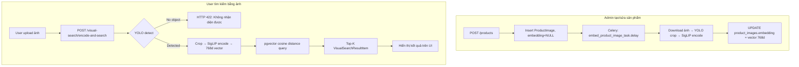

# Visual Search Pipeline — YOLO + SigLIP End-to-End

## Bối cảnh & Mục tiêu

Tính năng cho phép user **chụp ảnh / upload hình** trên trang `/products`, hệ thống:
1. Dùng **YOLOv8m** để detect object trong ảnh → crop ra bounding box có confidence cao nhất.
2. Dùng **SigLIP** (`google/siglip-base-patch16-224`, 768-d) để encode crop đó thành vector.
3. Dùng **pgvector cosine distance** trên bảng `product_images` để tìm top-k sản phẩm tương đồng nhất.

**Vấn đề hiện tại cần fix:**
- `product_images.embedding` đang là `Vector(512)` → cần **migrate lên 768-d**.
- Khi tạo/sửa sản phẩm có `image_url`, `ProductImage` đã được insert nhưng `embedding = NULL` → cần **Celery task** tự động embed sau khi insert.
- Frontend đang **fake vector** bằng cách sample bytes → cần gọi backend để tính vector thật.

---

## Quyết định đã xác nhận

| # | Câu hỏi | Quyết định |
|---|---|---|
| 1 | Embedding dimension | **768-d** — `google/siglip-base-patch16-224` |
| 2 | Model deployment | **On-server CPU** (MacBook Pro Intel i5, 16GB RAM) |
| 3 | YOLO size | **`yolov8m`** (~52MB) |
| 4 | Fallback khi YOLO không detect | **Trả lỗi cho user** |
| 5 | Re-index sản phẩm cũ | Không cần |

> [!WARNING]
> **DB Migration bắt buộc:** Cột `embedding` hiện tại là `Vector(512)`. Cần chạy `ALTER TABLE product_images ALTER COLUMN embedding TYPE vector(768)`. Toàn bộ giá trị `embedding` cũ (nếu có) sẽ **không còn hợp lệ** và phải embed lại.

> [!NOTE]
> **Latency thực tế trên máy dev (Intel i5 CPU-only, no GPU):**
> - Background embed khi admin tạo sản phẩm: ~10–15s — chạy Celery nền, không ảnh hưởng UX.
> - Real-time visual search (user upload): ~6–12s — user phải đợi. Acceptable cho dev/demo.

---

## Proposed Changes

### A. Database Schema Migration

#### [NEW] [`upgrade_embedding_vector_768.sql`](file:///Users/macos/Documents/AWS/electron-gate/backend/migrations/upgrade_embedding_vector_768.sql)
```sql
ALTER TABLE product_images
  ALTER COLUMN embedding TYPE vector(768);
```

#### [MODIFY] [`models.py`](file:///Users/macos/Documents/AWS/electron-gate/backend/api/models.py)
- Dòng 311: `embedding = Column(Vector(512))` → `embedding = Column(Vector(768))`

---

### B. Backend — ML Model Layer (mới hoàn toàn)

#### [NEW] `backend/rag_engine/visual_search/__init__.py`
File rỗng để đánh dấu package.

#### [NEW] [`siglip_encoder.py`](file:///Users/macos/Documents/AWS/electron-gate/backend/rag_engine/visual_search/siglip_encoder.py)
- **Singleton lazy-load** SigLIP model & processor (tải một lần, cache trong bộ nhớ).
- Model: `google/siglip-base-patch16-224` — output 768-d.
- `encode_image(image: PIL.Image) -> list[float]`: Preprocess → forward pass → L2 normalize → trả về vector 768-d.

#### [NEW] [`yolo_detector.py`](file:///Users/macos/Documents/AWS/electron-gate/backend/rag_engine/visual_search/yolo_detector.py)
- **Singleton lazy-load** YOLOv8m model (auto-download nếu chưa có).
- `detect_and_crop(image: PIL.Image) -> PIL.Image`:
  - Chạy inference → lấy bounding box có **confidence cao nhất**.
  - Nếu không detect được object nào → `raise ValueError("No object detected")`.
  - Crop theo bbox → return `PIL.Image`.

---

### C. Backend — Celery Tasks (Auto Embed)

#### [MODIFY] [`celery_app.py`](file:///Users/macos/Documents/AWS/electron-gate/backend/rag_engine/celery_app.py)
- Thêm `"rag_engine.visual_search.celery_tasks"` vào `include`.
- Thêm route: `"rag_engine.visual_search.celery_tasks.*": {"queue": "visual_search_queue"}`.

#### [NEW] [`backend/rag_engine/visual_search/celery_tasks.py`](file:///Users/macos/Documents/AWS/electron-gate/backend/rag_engine/visual_search/celery_tasks.py)

Task `embed_product_image_task(image_id: str, image_url: str)`:
1. Download ảnh từ `image_url` (HTTP GET, timeout 30s).
2. Open PIL → chạy `detect_and_crop()`.
   - Nếu detect fail → log warning, **set embedding = NULL** (bỏ qua không raise).
3. Chạy `encode_image()` → 768-d vector.
4. `UPDATE product_images SET embedding = <vector> WHERE image_id = <id>`.

> [!NOTE]
> Embedding task không raise exception để tránh crash Celery worker — lỗi chỉ được log.

---

### D. Backend — API Layer

#### [MODIFY] [`products.py`](file:///Users/macos/Documents/AWS/electron-gate/backend/api/routers/products.py)
- `create_product()` (line 218–225): Sau khi insert `ProductImage` và `db.commit()`, trigger:
  ```python
  embed_product_image_task.delay(str(image.image_id), body.image_url)
  ```
- `update_product()` (line 250–268): Tương tự — sau khi insert/update `ProductImage`, trigger task.

#### [NEW] [`backend/api/routers/visual_search.py`](file:///Users/macos/Documents/AWS/electron-gate/backend/api/routers/visual_search.py)

**Endpoint:** `POST /visual-search/encode-and-search`
- **Auth:** `get_current_user` (mọi user đã đăng nhập).
- **Input:** `multipart/form-data`: `file` (ảnh) + optional `top_k: int`, `category_id: UUID`, `min_similarity: float`.
- **Logic:**
  1. Load ảnh từ bytes upload.
  2. Chạy `detect_and_crop()` → nếu fail → HTTP 422 "Không nhận diện được sản phẩm trong ảnh".
  3. Chạy `encode_image()` → 768-d vector.
  4. Pgvector query (cosine distance) — tái sử dụng logic từ `search_products_by_image`.
  5. Return `list[VisualSearchResultItem]`.
- **Response schema:** Giữ nguyên `VisualSearchResultItem` từ `product_images.py`.

#### [MODIFY] [`main.py`](file:///Users/macos/Documents/AWS/electron-gate/backend/api/main.py)
- Import và `app.include_router(visual_search.router)`.

#### [MODIFY] [`requirements.txt`](file:///Users/macos/Documents/AWS/electron-gate/backend/requirements.txt)
```
ultralytics>=8.2.0
transformers>=4.40.0
torch>=2.2.0
torchvision>=0.17.0
```

---

### E. Frontend

#### [MODIFY] [`api.ts`](file:///Users/macos/Documents/AWS/electron-gate/frontend/src/app/lib/api.ts)
- Thêm function `apiVisualSearchByFile(file: File, token: string, opts?: {...}): Promise<VisualSearchResultItem[]>`:
  - Tạo `FormData`, append file.
  - `POST /visual-search/encode-and-search`.

#### [MODIFY] [`products/page.tsx`](file:///Users/macos/Documents/AWS/electron-gate/frontend/src/app/products/page.tsx)
- Hàm `performVisualSearch()` (line 256–277):
  - **Xoá** toàn bộ phần fake vector (lines 258–271).
  - **Thay bằng:** `const results = await apiVisualSearchByFile(file, token, { top_k: 8, category_id: selectedCategory })`.
  - Giữ nguyên phần preview ảnh, error handling, và UI.

---

## Luồng hoàn chỉnh



---

## Verification Plan

### Automated Tests
- `pytest` unit test `siglip_encoder.py`: assert `len(output) == 768`.
- `pytest` unit test `yolo_detector.py`: test với ảnh có object và ảnh blank.
- Integration: `POST /visual-search/encode-and-search` với ảnh keyboard thật → expect `similarity_score > 0`.

### Manual Verification
1. Tạo sản phẩm mới có `image_url` → check Celery worker log → sau ~15s, query DB:
   ```sql
   SELECT image_id, embedding IS NOT NULL FROM product_images ORDER BY created_at DESC LIMIT 5;
   ```
2. Upload ảnh bất kỳ trên `/products` → verify UI hiển thị kết quả (không crash, không fake data).
3. Upload ảnh trắng/blank → verify UI hiển thị error "Không nhận diện được sản phẩm".
